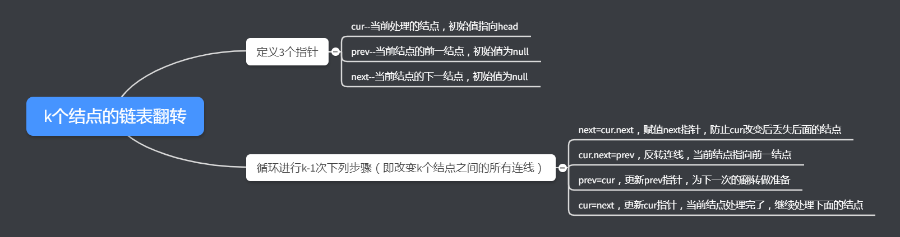

> 补课的周末是没有灵魂的


##### 25. k个一组翻转链表

给出一个链表，每 *k* 个节点一组进行翻转，并返回翻转后的链表。

*k* 是一个正整数，它的值小于或等于链表的长度。如果节点总数不是 *k* 的整数倍，那么将最后剩余节点保持原有顺序。

**示例 :**

给定这个链表：`1->2->3->4->5`

当 *k* = 2 时，应当返回: `2->1->4->3->5`

当 *k* = 3 时，应当返回: `3->2->1->4->5`

**说明 :**

- 你的算法只能使用常数的额外空间。
- **你不能只是单纯的改变节点内部的值**，而是需要实际的进行节点交换。


##### 解题思路

思路和昨天的题目差不多，相当于是它的进阶版。难点主要在怎么翻转k个结点的链表怎么翻转。

主要的步骤如下：




##### 代码

```javascript
var reverseKGroup = function(head, k) {
    let prev=null;
    let cur=head;
    let next=null;
    let p=head;
    let len=0;
    let cnt=0;
  	//计算链表长度
    while(p!=null){
        len++;
        p=p.next;
    }
  	//长度够k，可以进行翻转
    if(len>=k){
      	//核心处理
        while(cnt<k&&cur!=null){
            next=cur.next;
            cur.next=prev;
            prev=cur;
            cur=next;
            cnt++;
        }
        if(next!=null){
          	//head指针即翻转链表后的尾指针
            head.next=reverseKGroup(next,k);
        }
      	//prev指针即翻转链表后的头指针
        return prev;
    }
  	//长度小于k，不需要翻转
  	else{
        return head;
    }
};
```


##### 总结

链表的题目关键都在画图上，多画图去模拟一下，无论是对构建递归函数，还是对链表操作细节的完善都有很大的帮组。