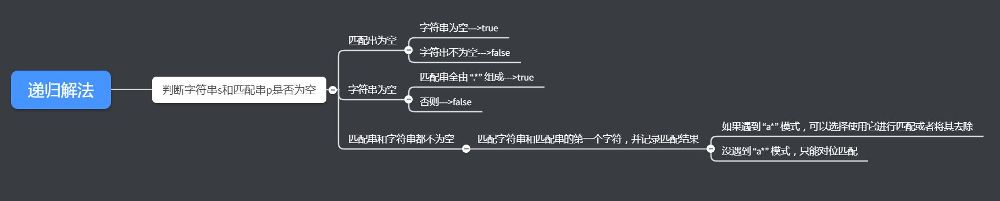
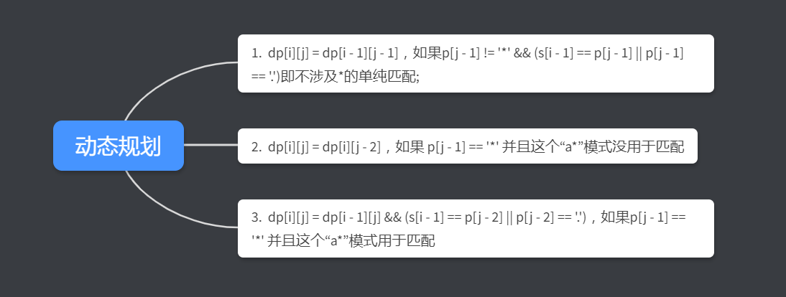
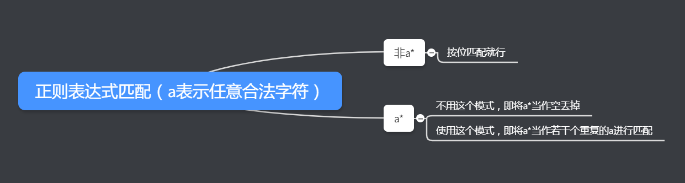

> 本来今天应该是写第九题的，但是第九题比较简单，而且是回文数，思路和前面的很多题都类似。所以我跳过了第九题。来讲讲Hard难度的第10题。


##### 10. 正则表达式匹配

给定一个字符串 (`s`) 和一个字符模式 (`p`)。实现支持 `'.'` 和 `'*'` 的正则表达式匹配。

```
'.' 匹配任意单个字符。
'*' 匹配零个或多个前面的元素。
```

匹配应该覆盖**整个**字符串 (`s`) ，而不是部分字符串。

**说明:**

- `s` 可能为空，且只包含从 `a-z` 的小写字母。
- `p` 可能为空，且只包含从 `a-z` 的小写字母，以及字符 `.` 和 `*`。

**示例 1:**

```
输入:
s = "aa"
p = "a"
输出: false
解释: "a" 无法匹配 "aa" 整个字符串。
```

**示例 2:**

```
输入:
s = "aa"
p = "a*"
输出: true
解释: '*' 代表可匹配零个或多个前面的元素, 即可以匹配 'a' 。因此, 重复 'a' 一次, 字符串可变为 "aa"。
```

**示例 3:**

```
输入:
s = "ab"
p = ".*"
输出: true
解释: ".*" 表示可匹配零个或多个('*')任意字符('.')。
```

**示例 4:**

```
输入:
s = "aab"
p = "c*a*b"
输出: true
解释: 'c' 可以不被重复, 'a' 可以被重复一次。因此可以匹配字符串 "aab"。
```

**示例 5:**

```
输入:
s = "mississippi"
p = "mis*is*p*."
输出: false
```


##### 解题思路

这道题有两个思路，一个是递归解，另外的就是用动态规划去解。先说第一个方法。


递归解法就是模拟我们按位去匹配的过程。

参考自：https://blog.csdn.net/ffffffzz94/article/details/79075153




动态规划就需要我们去找状态转移方程。

参考自：https://leetcode.com/problems/regular-expression-matching/discuss/5684/c-on-space-dp

我们定义一个二维的DP数组，其中`dp[i][j]`表示`s[0,i)`和`p[0,j)`是否匹配。

状态转移方程如下：




##### 代码

```javascript
//递归
var isMatch = function(s, p) {
    //匹配串为空
    if(p.length===0){
        if(s.length===0)
            return true;
        else
            return false;
    }
    //字符串为空
    if(s.length===0){
        if(p.length>=2&&p[1]==='*')
            return isMatch(s,p.substring(2));
        else
            return false;
    }
    //匹配串和字符串都不为空
    let firstMatch=s[0]===p[0]||p[0]==='.';
    if(p.length>=2&&p[1]==='*')
        return isMatch(s,p.substring(2))||(firstMatch && isMatch(s.substring(1),p));
    else
        return firstMatch&&isMatch(s.substring(1),p.substring(1));


};

//动态规划
var isMatch = function(s, p) {
    let dp=new Array(s.length+1);
    for(let i=0;i<s.length+1;i++)
        dp[i]=new Array(p.length+1).fill(false);

    dp[0][0] = true;
    for (let i = 0; i <= s.length; ++i) {
        for (let j = 1; j <= p.length; ++j) {
            if (j > 1 && p[j - 1] === '*') {
                dp[i][j] = dp[i][j - 2] || (i > 0 && (s[i - 1] === p[j - 2] || p[j - 2] === '.') && dp[i - 1][j]);
            } else {
                dp[i][j] = i > 0 && dp[i - 1][j - 1] && (s[i - 1] === p[j - 1] || p[j - 1] === '.');
            }
        }
    }
    return dp[s.length][p.length];
};
```


##### 总结

递归和动态规划的核心判断流程其实类似，但是动态规划可能比较绕。总的匹配可以分成三个部分：



