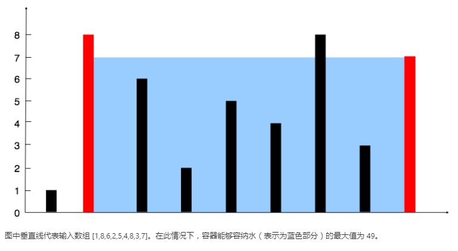
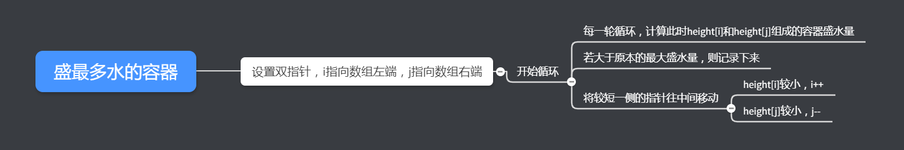

> 搞快点然后写项目去了


##### 11. 盛最多水的容器

给定 *n* 个非负整数 *a*1，*a*2，...，*a*n，每个数代表坐标中的一个点 (*i*, *ai*) 。在坐标内画 *n* 条垂直线，垂直线 *i* 的两个端点分别为 (*i*, *ai*) 和 (*i*, 0)。找出其中的两条线，使得它们与 *x* 轴共同构成的容器可以容纳最多的水。

**说明：**你不能倾斜容器，且 *n* 的值至少为 2。



**示例:**

```
输入: [1,8,6,2,5,4,8,3,7]
输出: 49
```


##### 解题思路

这种找个最优区间的一般都是用双指针做。




##### 代码

```javascript
var maxArea = function(height) {
    let i=0,j=height.length-1,res=0,tmp;
    while(i<j){
        tmp=Math.min(height[i],height[j])*(j-i);
        if(tmp>res)
            res=tmp;
        if(height[i]<height[j])
            i++;
        else
            j--;
    }
    return res;
};
```


##### 总结

套路题，也没什么好说的。双指针的题目主要是想好指针的初始指向以及在循环中怎么去移动指针，具体的根据题目分析即可。撸项目去了，掰~