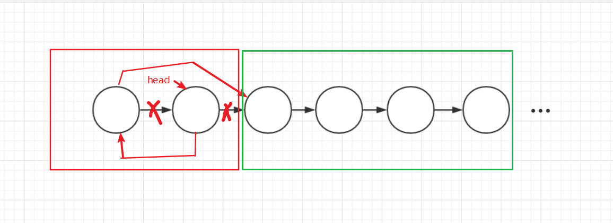

> coding...


##### 24. 两两交换链表中的结点

给定一个链表，两两交换其中相邻的节点，并返回交换后的链表。

**你不能只是单纯的改变节点内部的值**，而是需要实际的进行节点交换。

 

**示例:**

```
给定 1->2->3->4, 你应该返回 2->1->4->3.
```


##### 解题思路

这道题的题眼我感觉是“两两”，这种字眼的题目一般都能用递归去解决。

递归出口无非是子链表为空或者仅剩一个结点，无法交换的时候。

而每次递归我们就处理前两个结点，然后把第三个结点的指针传进递归函数中一直递归下去


##### 代码

```javascript
var swapPairs = function(head) {
    if(head==null||head.next==null){
        return head;
    }
    let next=head.next;
    head.next=swapPairs(next.next);
    next.next=head;
    return next;
};
```


##### 总结

递归问题的关键就是找题目中的重复操作，这道题里的重复操作很显然就是两两交换结点。



红框中就是一次递归中需要做的，然后将绿框中的链表再进行相同的红框内操作，直到所有都交换完。

递归的题目多画图，方便理解。