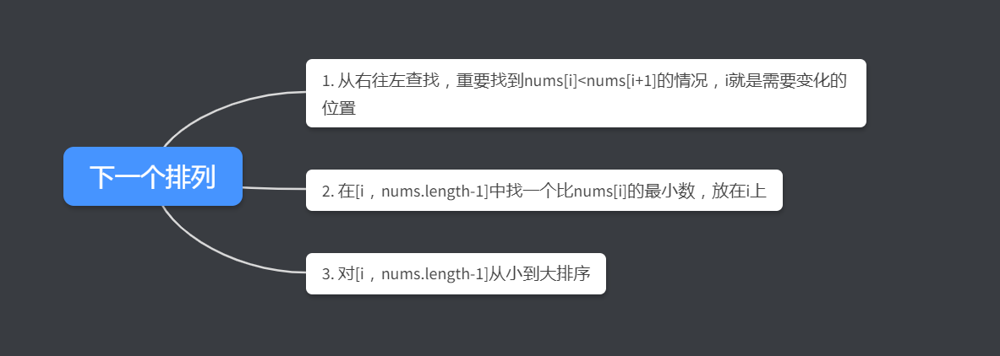

##### 31. 下一个排列

实现获取下一个排列的函数，算法需要将给定数字序列重新排列成字典序中下一个更大的排列。

如果不存在下一个更大的排列，则将数字重新排列成最小的排列（即升序排列）。

必须**原地**修改，只允许使用额外常数空间。

以下是一些例子，输入位于左侧列，其相应输出位于右侧列。
`1,2,3` → `1,3,2`
`3,2,1` → `1,2,3`
`1,1,5` → `1,5,1`


##### 解题思路

(思路参考官方题解：<https://leetcode-cn.com/problems/next-permutation/solution/>)

理解好题意，找下一个排列思路如下：




##### 代码

```javascript
var nextPermutation = function(nums) {
    let i=nums.length-2;
    while(i>=0&&nums[i+1]<=nums[i])
        i--;
    if(i>=0){
        let j=nums.length-1;
        while(j>=0&&nums[j]<=nums[i])
            j--;
        swap(i,j);
    }
    reverse(i+1);
    
    function swap(i,j){
        let temp = nums[i];
        nums[i] = nums[j];
        nums[j] = temp;
    }
  	//这个排序很巧妙，因为寻找i的时候是需要找nums[i]>nums[i+1]的，所以i+1之后的数字都是降序的，只要将反转就是升序了
    function reverse(start){
        let i=start,j=nums.length-1;
        while(i<j){
            swap(i,j);
            i++;
            j--;
        }
    }
};
```


##### 总结

这道题的关键是去理解题意，明白怎样找下一个排列，这方面比较偏数学一点。如果一开始没什么思路，有一个比较蠢的办法，你可以假设一个比较短的序列，然后将这个序列的所有排列情况写出来并从小到大排序。你在写的时候想下一个排列的过程就是我们解题的思路。

大多数的题都是这样，先瞎蒙，蒙着蒙着就有思路了。

下面有个官方的动图，可以帮助理解。

