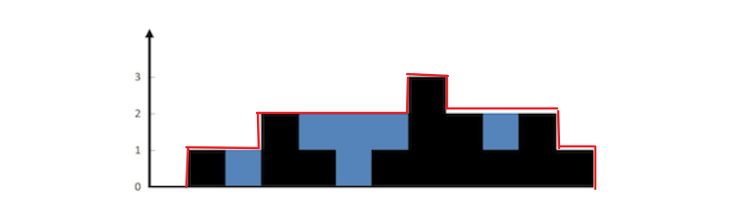
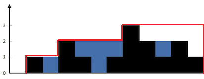
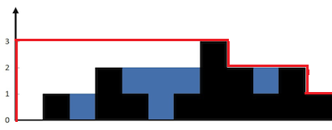
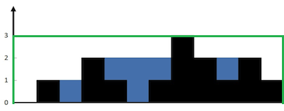

> 连续两天Hard的，有点烧脑


##### 42. 接雨水

给定 *n* 个非负整数表示每个宽度为 1 的柱子的高度图，计算按此排列的柱子，下雨之后能接多少雨水。


上面是由数组 [0,1,0,2,1,0,1,3,2,1,2,1] 表示的高度图，在这种情况下，可以接 6 个单位的雨水（蓝色部分表示雨水）。 **感谢 Marcos** 贡献此图。

**示例:**

```
输入: [0,1,0,2,1,0,1,3,2,1,2,1]
输出: 6
```


##### 解题思路

这道题的窍门在于观察图像，观察之后我们会发现一个有趣的结论，即：

接水数=轮廓(红线围住的)-柱子的面积(黑色部分)



现在的问题就成了怎么求轮廓的面积，因为柱子面积很好求。

我们先从左到右遍历，设定area初始值为0，每次把已遍历的柱高度中最大值累加进area中，一遍下来，area的几何意义为下图围住部分。



然后从右往左再遍历一次，同样的操作，一遍下来，area的几何意义为下图围住部分。



然后我们把这两个面积一加，就会发现，两个红线围住的面积和=下图中的绿线围住面积+柱面积+接水数




##### 代码

```javascript
/**
 * @param {number[]} height
 * @return {number}
 */
var trap = function(height) {
    let water=0,lMax=0,rMax=0;
    for(let i=0;i<height.length;i++){
      	//同时从两端开始遍历，简化代码
        lMax=Math.max(lMax,height[i]);
        rMax=Math.max(rMax,height[height.length-i-1]);
      	//减去height[i]即柱面积
        water=water+lMax+rMax-height[i];
    }
  	//减去绿线围住部分
    return water-height.length*lMax;
};
```


##### 总结

讨论区真是个好地方，有时候想不出来就看看大佬的想法。想明白了，再自己表达一遍加深印象，也能有不错的提升，共勉。
