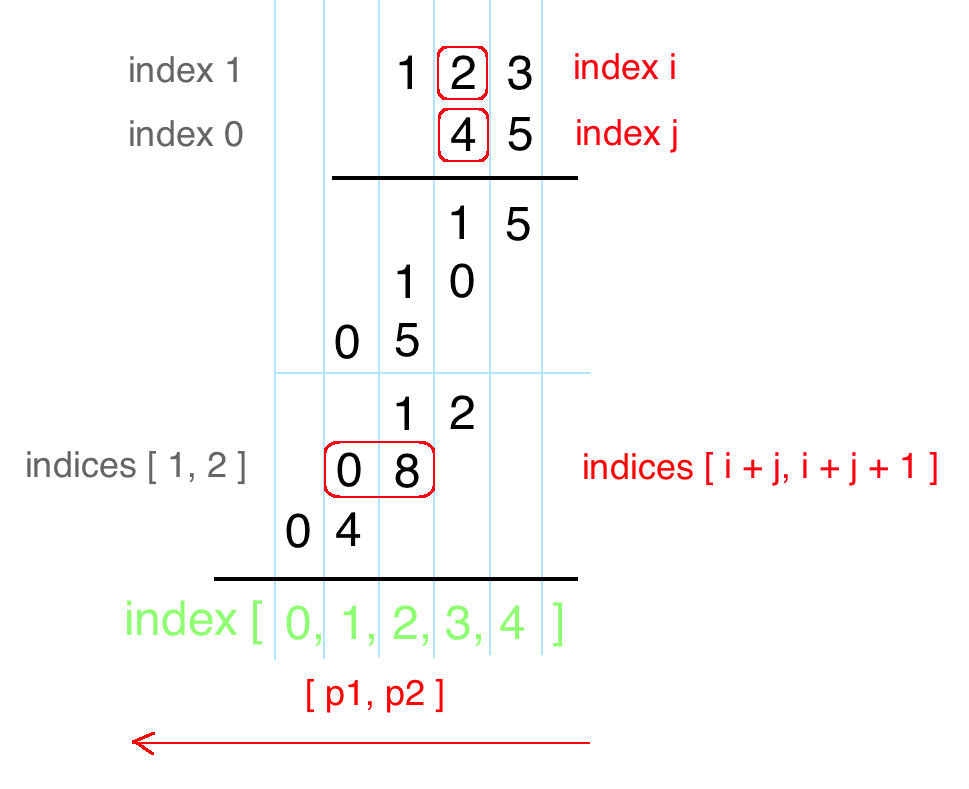

##### 43. 字符串相乘

给定两个以字符串形式表示的非负整数 `num1` 和 `num2`，返回 `num1` 和 `num2` 的乘积，它们的乘积也表示为字符串形式。

**示例 1:**

```
输入: num1 = "2", num2 = "3"
输出: "6"
```

**示例 2:**

```
输入: num1 = "123", num2 = "456"
输出: "56088"
```

**说明：**

1. `num1` 和 `num2` 的长度小于110。
2. `num1` 和 `num2` 只包含数字 `0-9`。
3. `num1` 和 `num2` 均不以零开头，除非是数字 0 本身。
4. **不能使用任何标准库的大数类型（比如 BigInteger）**或**直接将输入转换为整数来处理**。


##### 解题思路

这道题其实就是大数相乘，是很常见的面试题，考究进位的处理。我之前一直是按位处理，然后每次都写的很辛苦，这次学了个大神的做法。

[参考链接](https://leetcode.com/problems/multiply-strings/discuss/17605/Easiest-JAVA-Solution-with-Graph-Explanation)




大数相乘难处理的是进位，以及下标与数位的对应问题。这里我们这样解决：

把num1的第i位(高位从0开始)和num2的第j位相乘的结果放在结果数组中的[i+j, i+j+1]

举个例子：123*45，第1位的2和第0位的4相乘等于08，放在[1,2]的位置上。这样子我们就能对每两个数字拿出来乘完再放到相应的位置。


##### 代码

```javascript
/**
 * @param {string} num1
 * @param {string} num2
 * @return {string}
 */
var multiply = function(num1, num2) {
    let len1=num1.length;
    let len2=num2.length;
    if(len1===0||len2===0)
        return '';
    let res=new Array(len1+len2).fill(0);
    for(let i=len1-1;i>=0;i--){
        for(let j=len2-1;j>=0;j--){
            let bit=num1[i]*num2[j];
            bit+=res[i+j+1];
            res[i+j]+=bit/10|0;
            res[i+j+1]=bit%10;
        }
    }
    let i=0;
    let finalRes=[];
  	//处理前导0
    while(i<res.length-1&&res[i]===0)
        i++;
    for(;i<res.length;i++)
        finalRes.push(res[i]);
    return finalRes.join('');
};
```


##### 总结

1. 总思路是按位两两乘放进数组里，最后再转成字符串
2. m位乘于n位，积的长度为m+n或m+n-1，所以预设长度为m+n
3. 把num1的第i位(高位从0开始)和num2的第j位相乘的结果放在结果数组中的[i+j, i+j+1]
4. 处理前导0