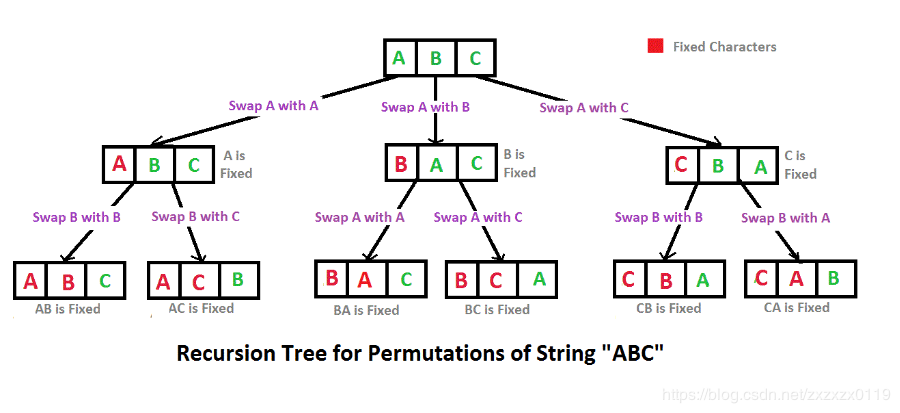

> 早上出去现在才回了，赶紧更新


##### 46.全排列

给定一个**没有重复**数字的序列，返回其所有可能的全排列。

**示例:**

```
输入: [1,2,3]
输出:
[
  [1,2,3],
  [1,3,2],
  [2,1,3],
  [2,3,1],
  [3,1,2],
  [3,2,1]
]
```


##### 解题思路

对于这种我们生活中有原型可以参考的题目，应该去模拟我们生活里的做法去寻找思路。



我们采用变量n来记录整体过程的进展，n∈[0,nums.length-1]，每次就交换nums[i]（i∈[0,nums.length-1]）和nums[n]，更新子状态，往深处递归。整个算法的过程就是上面的这棵树先序遍历的结果。


##### 代码

```javascript
/**
 * @param {number[]} nums
 * @return {number[][]}
 */
var permute = function(nums) {
    let res=[];
    foo(0);
    return res;
    
    function foo(n){
        if(n===nums.length){
            let tmp=nums.slice(0);
            res.push(tmp);
        }
        else{
            for(let i=n;i<nums.length;i++){
                swap(n,i);
                foo(n+1);
                swap(n,i);
            }
        }
    }
    function swap(a,b){
        let tmp=nums[a];
        nums[a]=nums[b];
        nums[b]=tmp;
    }
};
```


##### 总结

思路源自生活。还有就是，我发现顺着刷的话有时候会连续几天做同样类型的题目，有点审美疲劳。所以以后会开始随机的做题，这样做题训练的覆盖面更广一点。

