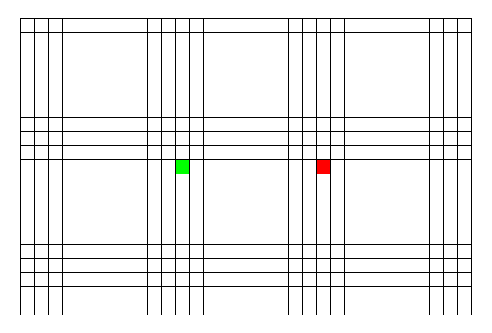

##### 542. 01矩阵

给定一个由 0 和 1 组成的矩阵，找出每个元素到最近的 0 的距离。

两个相邻元素间的距离为 1 。

**示例 1:** 
输入:

```
0 0 0
0 1 0
0 0 0
```

输出:

```
0 0 0
0 1 0
0 0 0
```

**示例 2:** 
输入:

```
0 0 0
0 1 0
1 1 1
```

输出:

```
0 0 0
0 1 0
1 2 1
```

**注意:**

1. 给定矩阵的元素个数不超过 10000。
2. 给定矩阵中至少有一个元素是 0。
3. 矩阵中的元素只在四个方向上相邻: 上、下、左、右。


##### 解题思路

看着这样的图还有题目，多半是用DFS或者BFS做。因为之前用DFS解了很多了，这里就用BFS吧。

BFS，Breadth First Search即宽度优先搜索。和之前说过的深搜即DFS，“不撞南墙不回头，一条路走到黑”的特点不同，宽搜是一层一层的往外探索，有点像往湖里投了颗石子产生的涟漪一样。

下面有两张图可以直观的感受到深搜和宽搜的区别以及他们的特点：

(图源自<https://cuijiahua.com/blog/2018/01/alogrithm_10.html>)


DFS：




BFS：


言归正传，我们来用BFS解题。首先我们遍历矩阵，把等于0的坐标点先放入队列中（即作为第一层），第一层中的坐标点都为0，所以到达0的最短距离也是0；然后我们处理第二层，即离第一层中坐标点只有一步距离的点，显然第二层的点到0的最短距离为1，即第一层到0的最短距离+1；后面的依次类推......


##### 代码

```javascript
var updateMatrix = function(matrix) {
  	//定义四个方向
    let move=[[0,1],[1,0],[0,-1],[-1,0]];
    let queue=[];
    let row=matrix.length;
    let col=matrix[0].length;
  	//处理为0的坐标点，将其放入队列中；把为1的坐标点标记为较大的数，表示待处理
    for(let i=0;i<row;i++){
        for(let j=0;j<col;j++){
            if(matrix[i][j]===0)
                queue.push([i,j]);
            else
                matrix[i][j]=row+col;
        }
    }
  	//逐层处理
    while(queue.length!==0){
        let tmp=queue.shift();
        for(let i=0;i<4;i++){
            let r=tmp[0]+move[i][0];
            let c=tmp[1]+move[i][1];
          	//判断是否越界以及新到达的点是否没被处理
            if(r>=0&&r<row&&c>=0&&c<col&&matrix[r][c]>matrix[tmp[0]][tmp[1]]+1){
                matrix[r][c]=matrix[tmp[0]][tmp[1]]+1;
                queue.push([r,c]);
            }
        }
    }
    return matrix;
};
```


##### 总结

相比与深搜，宽搜的特点是会使用到队列。特点为涟漪式的往外扩张搜索，正是因为这个特点，迷宫问题中宽搜得到的路径为最短路径。
