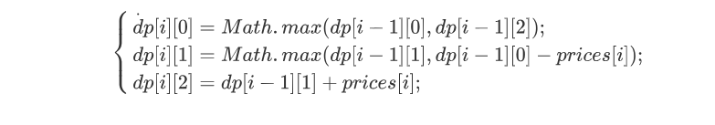

##### 309. 最佳买卖股票时机含冷冻期

给定一个整数数组，其中第 *i* 个元素代表了第 *i* 天的股票价格 。

设计一个算法计算出最大利润。在满足以下约束条件下，你可以尽可能地完成更多的交易（多次买卖一支股票）:

- 你不能同时参与多笔交易（你必须在再次购买前出售掉之前的股票）。
- 卖出股票后，你无法在第二天买入股票 (即冷冻期为 1 天)。

**示例:**

```
输入: [1,2,3,0,2]
输出: 3 
解释: 对应的交易状态为: [买入, 卖出, 冷冻期, 买入, 卖出]
```


##### 解题思路

今天也是一道dp。不过相比于昨天那道复杂一点。

这道题中，“状态”为最大收益，但是他们的转移方式有3种：未持有，持有和冷冻期。

首先，创建一个二维的dp数组表示最大收益

第一维表示天数，第二维中0表示当天未持有股票，1表示持有股票，2表示处于冷冻期。

而状态转移方程如下：



代表的情况分别为：

* 当天为未持有，前一天的状态只能是未持有或者冷冻期
* 当天为持有，可能是保持着手头的股票，或者从未持有状态重新收购股票
* 当天为冷冻期，说明原本持有的股票卖出去了


##### 代码

```javascript
/**
 * @param {number[]} prices
 * @return {number}
 */
var maxProfit = function(prices) {
    let len=prices.length;
    if(len===0)
        return 0;
    //创建一个二维的dp数组表示最大收益
    //第一维表示天数，第二维中0表示当天未持有股票，1表示持有股票，2表示处于冷冻期
    let dp=new Array(len);
    for(let i=0;i<len;i++){
        dp[i]=new Array(2);
    }
    //初始化第一天的最大收益
    dp[0][0]=0;
    dp[0][1]=-prices[0];
    dp[0][2]=0;
    for(let i=1;i<len;i++){
        //当天为未持有，前一天的状态只能是未持有或者冷冻期
        dp[i][0]=Math.max(dp[i-1][0],dp[i-1][2]);
        //当天为持有，可能是保持着手头的股票，或者从未持有状态重新收购股票
        dp[i][1]=Math.max(dp[i-1][1],dp[i-1][0]-prices[i]);
        //当天为冷冻期，说明原本持有的股票卖出去了
        dp[i][2]=dp[i-1][1]+prices[i];
    }
    //最后为了获取最大收益肯定将股票卖出
    return Math.max(dp[len-1][0],dp[len-1][2]);
};
```
