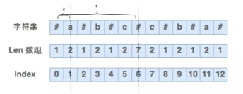
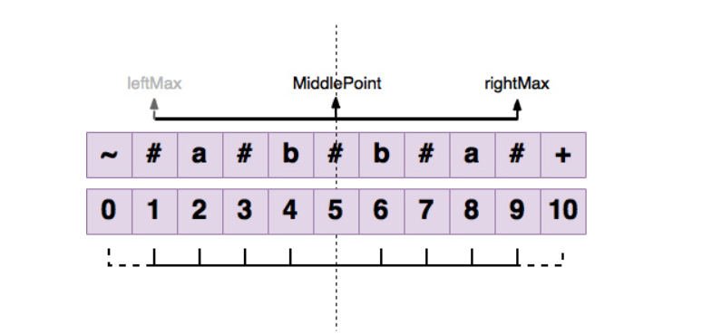
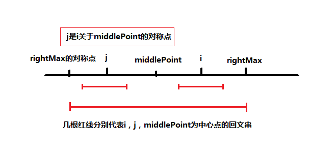
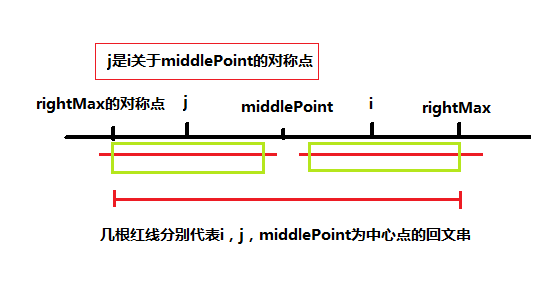

> 又起晚了。8多说，开冲。


##### 5. 最长回文子串

给定一个字符串 `s`，找到 `s` 中最长的回文子串。你可以假设 `s` 的最大长度为 1000。

**示例 1：**

```
输入: "babad"
输出: "bab"
注意: "aba" 也是一个有效答案。
```

**示例 2：**

```
输入: "cbbd"
输出: "bb"
```


##### 解题思路

最长回文子串是一个比较经典的题目了。常规的解决方法是用动态规划和中心检测法去解。我们先说一下动态规划解法的思路。

我们创建一个二维数组dp，记录s的所有的子串是否为回文串。`dp[i][j]`表示以从`s[i]`到`s[j]`的子串是否为回文串。状态转移方程如下：
$$
dp[i][j]=\left\{
\begin{aligned}
1 && i=j \\
2 && s[i]=s[j]\text{且}j-i=1\\
dp[i+1][j-1]+2 && s[i]=s[j]\text{且}dp[i+1][j-1]>0\\
0 && \text{其他情况时}
\end{aligned}
\right.
$$
`dp[i][i]`的值x，大于0时代表该子串是回文串且长度为x；等于0时代表其不是回文串。

1. 当`i=j`的时候很好理解，就是长度为1的子串，也算是回文串。
2. 当`s[i]=s[j]且j-i=1`时，代表子串长度为2的回文串，如`aa`、`bb`等。
3. 当子串长度大于3时，如果`s[i]=s[j]`说明子串的状态类似于`a.....a`，下面我们就只需要判断`......`是不是回文串，如果是的话将`.....`的dp值加上2就是`dp[i][j]`的值。
4. 其他情况说明子串不是回文串

但是动态规划的时间复杂度为O(n^2)。执行用时很高，s上限仅仅1000就达到了552ms。


中心检测法则是分别以s中的每个字符为中心，逐一检测以其为中心的最长回文子串是多少。需要注意的是，字符串的奇偶对于检测来说是有区别的。举个例子，像是`aabb`，这个回文串的中心是在a和b之间；而对于`aabaa`来说，回文串的中心是b。

这个方法的时间复杂度也是O(n^2)，但是因为它不需要用二维数组，所以空间复杂度较小，为O(1)。


而有一个著名的马拉车算法（Manacher‘s Algorithm），在解决回文串方面的问题能达到O(n)的时间复杂度。一定程度上它可以看作是中心检测法的升级。

> （整理自：https://segmentfault.com/a/1190000006875558 && https://www.cnblogs.com/grandyang/p/4475985.html）

1. 首先它解决了中心检测法中需要区别奇偶的麻烦，它将s的空缺插满了特殊字符（s中不含有的字符），举个例子：`ababa` => `#a#b#a#b#a#`，这样之后字符串长度就必然是奇数了，中心就很好判断。

2. 为了方便判断越界，在步骤1得到的字符串s‘首尾加上两个不同的字符（s'中不含有的），再举个例子：`#a#b#a#b#a# `=> `+#a#b#a#b#a#-`。

3. 经过两步预处理后就到了正式环节，马拉车算法中定义了一个回文半径数组Len，用 Len[i] 表示以第 i 个字符为对称轴的回文串的回文半径。例子如图

   

   那问题就简化到了怎样去用一个线性时间复杂度的算法去快速求出len数组。

   ①我们定义两个值middlePoint和rightMax，middlePoint是有效的中心点， rightMax 为 middlePoint 对应的回文字符串的右边界。

   

   ②接下来就是这个算法的核心：

   `len[i] = rightMax > i ? min(len[2 * middlePoint- i], rightMax - i) : 1;`

   ③我们分开来看：

   ​    它的意思是：如果 rightMax > i, 则 len[i] = min( len[2 * middlePoint- i] , rightMax - i )

   ​			   否则，len[i] = 1

   ​    当` rightMax - i > len[j]` 的时候以s[j]为中心的回文子串包含在以s[middlePoint]为中心的回文子串中，由于 i 和 j 对称，以s[i]为中心的回文子串必然包含在以s[middlePoint]为中心的回文子串中，所以必有 len[i] = len[j]，其中 `j = 2*id - i`，因为 j 到 middlePoint 之间的距离等于 id 到 middlePoint 之间到距离，为` i - middlePoint`，所以` j = middlePoint- (i - middlePoint) = 2*middlePoint- i`。

   

   而如果当 `len[j] >= rightMax - i `，以s[j]为中心的回文子串不一定完全包含于以s[middlePoint ]为中心的回文子串中，但是基于对称性可知，下图中两个绿框所包围的部分是相同的，也就是说以s[i]为中心的回文子串，其向右至少会扩张到rightMax 的位置，也就是说`len[i] = rightMax - i`。至于rightMax之后的部分是否对称，就只能继续去匹配了。

   

   对于 rightMax <= i 的情况，无法对 len[i]做更多的假设，只能len[i] = 1，然后再去匹配了。


##### 代码

```javascript
//方法一：动态规划
var longestPalindrome = function(s) {
    let len=s.length;
    let dp=new Array(len);
    for(let i=0;i<len;i++){
        dp[i]=new Array(len);
        for(let j=0;j<len;j++){
            if(i===j){
                dp[i][j]=1;
            }
            else dp[i][j]=0;
        }
    }
    let max=1;
    let startIndex=0;
    for(let j=0;j<len;j++){
        for(let i=j-1;i>=0;i--){
            if(s[i]===s[j]){
                if(j-i===1) dp[i][j]=2;
                else{
                    if(dp[i+1][j-1]){
                        dp[i][j]=dp[i+1][j-1]+2;
                    }
                    else dp[i][j]=0;
                }
            }
            else dp[i][j]=0;
            if(dp[i][j]>max){
                max=dp[i][j];
                startIndex=i;
            }
        }
    }
    return s.substring(startIndex,startIndex+max);
};

//方法二：马拉车算法
var longestPalindrome = function(s) {
    //预处理字符串

    let tmp='$#';
    for(let i=0;i<s.length;i++){
        tmp+=s[i];
        tmp+='#';
    }
    tmp+='-';
    let len=new Array(tmp.length);
    let rightMax=0,middlePoint=0,resLen=0,resCenter=0;
    for(let i=0;i<tmp.length;i++){
        len[i]=rightMax>i?Math.min(len[2*middlePoint-i],rightMax-i):1;
        while (tmp[i+len[i]]===tmp[i-len[i]])
            len[i]++;
        if (rightMax < i + len[i]) {
            rightMax = i + len[i];
            middlePoint = i;
        }
        if (resLen < len[i]) {
            resLen = len[i];
            resCenter = i;
        }
    }
    return s.substr((resCenter - resLen) / 2, resLen-1);

};
```


##### 总结

几乎要说的都在解题思路里面说了，总结没什么好说的。其实整篇文章早上写完大部分了，但该死的马拉车，后面调试学思路的时候花了很多时间，所以拖到了晚上。今天就这样了~掰掰。