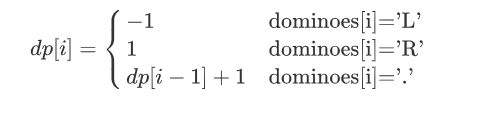

##### 838.推多米诺

一行中有 `N` 张多米诺骨牌，我们将每张多米诺骨牌垂直竖立。

在开始时，我们同时把一些多米诺骨牌向左或向右推。


每过一秒，倒向左边的多米诺骨牌会推动其左侧相邻的多米诺骨牌。

同样地，倒向右边的多米诺骨牌也会推动竖立在其右侧的相邻多米诺骨牌。

如果同时有多米诺骨牌落在一张垂直竖立的多米诺骨牌的两边，由于受力平衡， 该骨牌仍然保持不变。

就这个问题而言，我们会认为正在下降的多米诺骨牌不会对其它正在下降或已经下降的多米诺骨牌施加额外的力。

给定表示初始状态的字符串 "S" 。如果第 i 张多米诺骨牌被推向左边，则 `S[i] = 'L'`；如果第 i 张多米诺骨牌被推向右边，则 `S[i] = 'R'`；如果第 i 张多米诺骨牌没有被推动，则 `S[i] = '.'`。

返回表示最终状态的字符串。

**示例  1：**

```
输入：".L.R...LR..L.."
输出："LL.RR.LLRRLL.."
```

**示例2：**

```
输入："RR.L"
输出："RR.L"
说明：第一张多米诺骨牌没有给第二张施加额外的力。
```

**提示：**

1. `0 <= N <= 10^5`
2. 表示多米诺骨牌状态的字符串只含有 `'L'`，`'R'`; 以及 `'.'`;


##### 解题思路

这道题的解法其实挺多的，你可以用双指针去记录离'.'最近的'L'和'R'，根据距离来更新dominoes数组；也可以用两个栈来分别记录L和R的位置来做。但是这两种方法都要分很多情况去讨论，脑子很疼......


这里用的是dp，我们第一次从左往右去遍历dominoes数组，仅考虑R的影响，dp方程为：



以示例1举例：

```
输入：".L.R...LR..L.."
第一次处理后，dp如下：
dp：[0，-1，0，1，2，3，4，-1，1，2，3，-1，0，0]
ps：等于0表示'.',大于0表示'R'，小于0表示'L'
```

然后第二次，从右往左遍历，更新dp数组，这次我们去考虑L的影响：

观察第一次得到的dp数组，其实需要我们去更新的序列都是形如`1，2，3，...，-1`即`R....L`这样的序列，我们取一小段来分析：

```
部分序列："R..L"
应该输出："RRLL"
部分dp如下：
dp：[1，2，3，-1]
```

dp[2] (dp[i]) 中的3其实可以看作是最左边的R对当前这个位置的影响，而最右边的L对这个位置的影响可以看作是dp[3]-1=-2(即dp[i+1]-1)，对比这两个影响，绝对值越大其实代表其影响源越远，所以两者相加(dp[i]+dp[i+1])如果大于0，说明i离L较近，当前位置应该为L；小于0，说明i离R较近，当前位置应该为R；等于0，说明i离R和L的距离相等，当前位置应该为'.'。

整体可能比较绕，看代码结合理解应该会好一点。


##### 代码

```javascript
/**
 * @param {string} dominoes
 * @return {string}
 */
var pushDominoes = function(dominoes) {
    let len=dominoes.length;
    let dp=new Array(len).fill(0);
    for(let i=0;i<len;i++){
        if(dominoes[i]==='.'){
            if(i>0&&dp[i-1]>0)
                dp[i]=dp[i-1]+1;
        }
        else if(dominoes[i]==='L'){
            dp[i]=-1;
        }
        else{
            dp[i]=1;
        }
    }
    let res=new Array(len);
    for(let i=len-1;i>=0;i--){
        if(dominoes[i]==='.'){
            if(i<len-1&&dp[i+1]<0){
                if(dp[i]+dp[i+1]-1>0)
                    dp[i]=dp[i+1]-1;
                else if(dp[i]+dp[i+1]-1===0)
                    dp[i]=0;
              	//处理.的右边有L，左边却没有R的特殊情况
                else if(dp[i]===0)
                    dp[i]=dp[i+1]-1;
            }
        }
        if(dp[i]===0)
            res[i]='.';
        else if(dp[i]>0)
            res[i]='R';
        else
            res[i]='L';
    }
    return res.join('');
};
```
